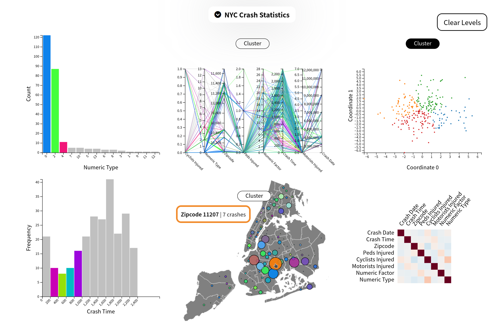
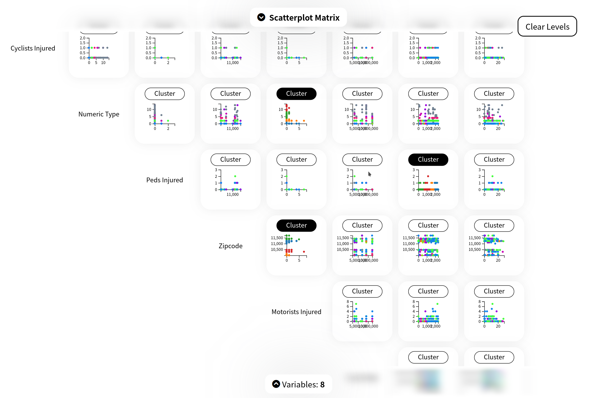

# A D3.js Dashboard: Visualizing and Exploring NYC Car Crash Statistics (or whatever you want)



[](https://github.com/psf/black)

This is an MVC-ish Flask app that uses D3 to render some graphs (correlation matrix, scatterplots, loadings, etc.), optimized for a 2256x1504 display. It can be run natively or in a Docker container.

The sample data used was randomly sampled from [NYC Open Data](https://data.cityofnewyork.us/Public-Safety/Motor-Vehicle-Collisions-Crashes/h9gi-nx95). This data, a Motor Vehicle Collisions crash table, contains details about recent crash events from all over NYC, where each row is such a crash, as reported by the police. The police report (MV104-AN) from which the data was gathered are required to be filled out if someone is injured or killed, or if there is at least $1,000 worth of damage. This data can be used to conduct detailed traffic safety analyses so as to find ways to prevent collisions or even advocate for public transit. If you would like to use different data, you can change the `DATA=` line in `.env` to point to a different CSV file.



You are able to choose which graph you'd like to focus on, reduce the number of (or change the) variables presented, k-means cluster certain graphs, and select elements of certain graphs to highlight them and corresponding ones in other graphs (ie. brushing and linking). This interactivity serves to overcome the problem of data deluge, letting you choose between seeing the forest for the trees or the trees for the forest. As an example, here are two data stories the graphs present:

Let's first split the crashes into two groups: those that are less likely to occur in the morning and those that are more. From these we can generate two data stories. The respective first focuses on a string of zip codes in northern Brooklyn, from Atlantic Avenue above Prospect Park across to Canarsie and back up to Atlantic Avenue—parallel to the Brooklyn-Queens border, with a relatively high quantity of crashes. The problematic vehicles here are more likely to be sedans and taxis, the former being more likely to injure multiple pedestrians and motorists and the latter being the least likely vehicle (out of the top three most common ones) to injure any person. While these crashes happen near each other, they happen at various times of the day; a possible solution is to promote mass transit in this area, as it can be improved to handle the large, though spread out, load, to reduce the number of sedans out.
The second focuses on several zip codes in Long Island City, in front of JFK airport, where the Cross Bay Boulevard connects to The Rockaways, and by Sound View Park in the Bronx, also with a relatively high quantity of crashes. The problematic vehicles here are more likely to be SUVs than taxis, and they are more likely to injure at least one person. While these crashes are all common in the morning, the locations are not near each other; a possible solution is to introduce a green tax to encourage the uptake of smaller vehicles.

## Running

From the directory of this file:

### Bare Metal

1. Update `python3` to the latest version.
2. Run `python3 -u app.py`

### Docker

1. Run

```bash
docker build -t dash .
docker run -p 8000:8000 dash
```

2. Wait for Flask to say it's running
3. Open your browser to `http://0.0.0.0:8000`

---

Copyright (c) 2022  ipitio

This program is free software: you can redistribute it and/or modify
it under the terms of the GNU Affero General Public License as published
by the Free Software Foundation, either version 3 of the License, or
(at your option) any later version.

This program is distributed in the hope that it will be useful,
but WITHOUT ANY WARRANTY; without even the implied warranty of
MERCHANTABILITY or FITNESS FOR A PARTICULAR PURPOSE.  See the
GNU Affero General Public License for more details.

You should have received a copy of the GNU Affero General Public License
along with this program.  If not, see <http://www.gnu.org/licenses/>.
